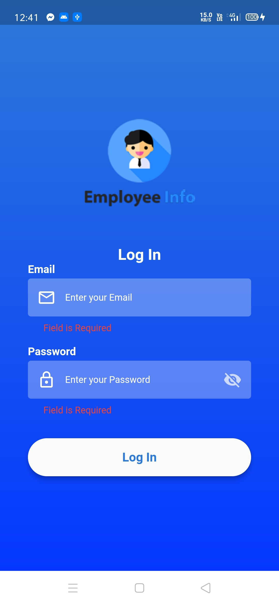
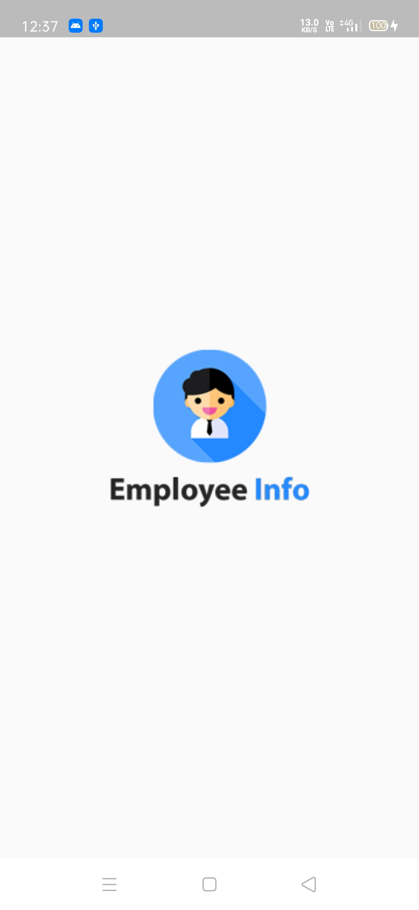
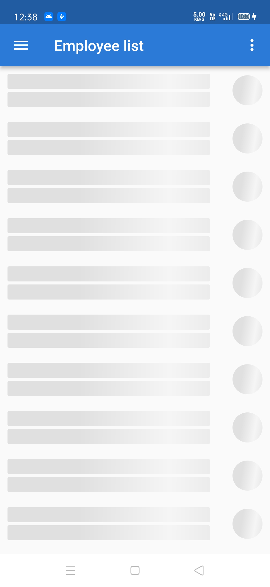
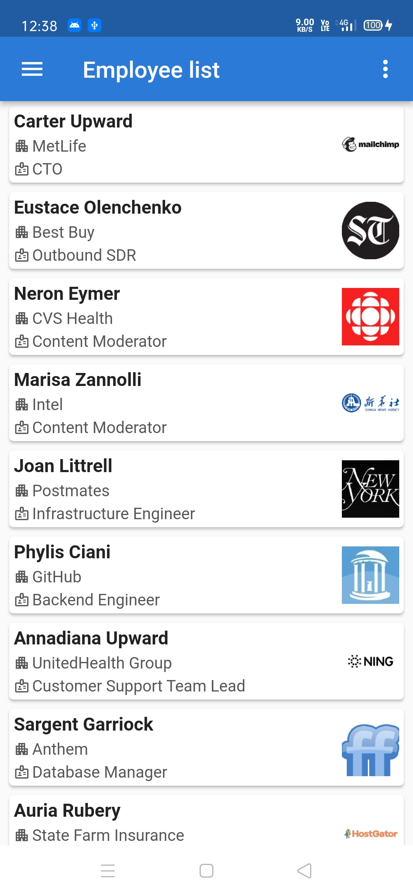
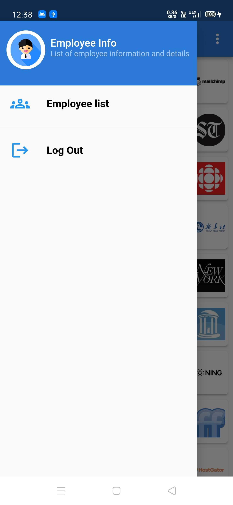
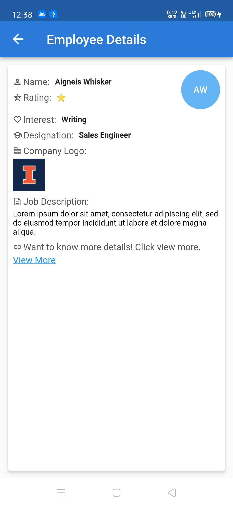

# Employee info

A new Flutter project for employee informations.

## API
- See the project implementation.

## App Features :dart:

- Splash screen
- Login form with validation
- Shimmer loading effect
- Employee data load in listview
- Details page
- Two page transitions
- Navigation drawer
- Action menu
- Logout

## Screenshots 📸

|                                  |                                  |                                  |
|----------------------------------|----------------------------------|----------------------------------|
|  |  |  |
|  |  |  |

## Getting Started

This project is a starting point for a Flutter application.

A few resources to get you started if this is your first Flutter project:

- [Lab: Write your first Flutter app](https://docs.flutter.dev/get-started/codelab)
- [Cookbook: Useful Flutter samples](https://docs.flutter.dev/cookbook)

For help getting started with Flutter development, view the
[online documentation](https://docs.flutter.dev/), which offers tutorials,
samples, guidance on mobile development, and a full API reference.

## Contact :link:
[Linkedin](https://www.linkedin.com/in/iamrajdev/)
